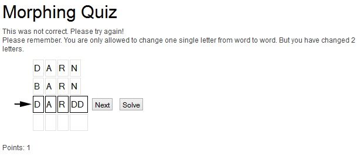
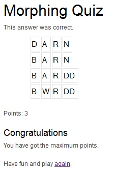
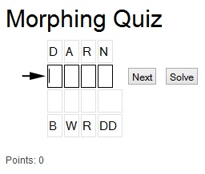

.. ==================================================
.. FOR YOUR INFORMATION
.. --------------------------------------------------
.. -*- coding: utf-8 -*- with BOM.

.. include:: ../Includes.txt

.. _introduction:

Introduction
============

.. _what-it-does:

What does it do?
----------------

With this game you get the first word. The next words you need to guess. All words have the same number of letters and 
you are only allowed to change one letter from word to word. For every right word you can get plus points. 
For every wrong word you can get minus points. If you have successfully guessed all words you can show a final text. 
All final texts can be displayed depending to the points the player has reached.

.. _screenshots:

Screenshots
-----------

Here you can see a morphing quiz game. The first word is already successfully guessed.

.. image:: ../Images/morphquiz_example1.jpg
   :alt: Morphing quize game example 1

|
| The player has guessed the wrong word

 
|
| The final text is shown at the end.

|
| Optionaly you can show the first and the last word. All words in between need to be guessed.

