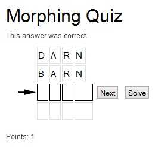

.. ==================================================
.. FOR YOUR INFORMATION
.. --------------------------------------------------
.. -*- coding: utf-8 -*- with BOM.

.. include:: ../Includes.txt

.. _user-manual:

Users Manual
============

Create words
------------

First you need to create the word for the morphing quiz game. Therfore you need to create a folder and
go with the list view in there. Here you can add an element.

Creation of a word.

After this you need to enter a name for the word and the value, which has to be guessed. All fields got a
context sensitive help, which you can access if you go with the mouse over the caption of the fields. Here
you find a more detailed description for every field in the mask. You need to enter in every word the next
word except for the last word. Here you need to leave this field empty. Thats why it is a good idea to
start with the last word and create all the other words from the last one to the first.

The context sensitive help in the input mask of a word.

|

Create a finishing text
-----------------------

After the creation of all word you need to create the finishing text. This you need to create also as an
element in the list view of the folder.

The context sensitive help in the input mask of a finishing text.

|

Create a frontend plugin
------------------------

After all, you need to create a page in the page view of the Typo3 backend.

Create a plugin element in the page for the frontend

Go into the plugin. Here you can find a lot of options you can adjust for the game. All options are also
with a context sensitive help if you go with the mouse over a caption. Read this descriptions very
carefully. You need at least input the first word in the game and all final texts you need in the game.

Configuration of the frontend plugin.

|

Localisation
------------

You find all localisation files in the folder

::

	Resources\Private\Language\

If you want to change the language settings in the file ``locallang.xlf`` or you need to add the following typoscript.

::

	plugin.tx_glmorphquiz_pi1._LOCAL_LANG.de.<any_label> = Text for the label
	plugin.tx_glmorphquiz_pi1._LOCAL_LANG.de.fluid_button_solve = Auflösen
	plugin.tx_glmorphquiz_pi1._LOCAL_LANG.en.fluid_button_solve = Help

For a localisation of the finishing text you need to add a new language for the folder which
contains the finshing texts.

Create a language for the folder

After that you can go into a finishing text an choos a new language at the top of the page.

Create a language for the finshing text

Now you need to assign this finishing text to the plugin in the configuration view of the
frontend plugin.

Assign the finishing text to the frontend pluging

Now you can test the morphing quiz game with your browser at the frontend.

